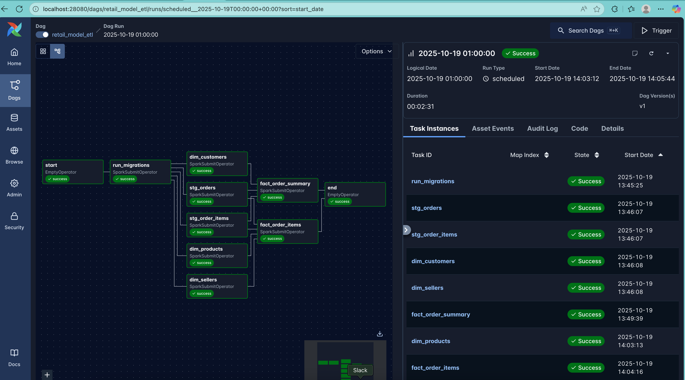
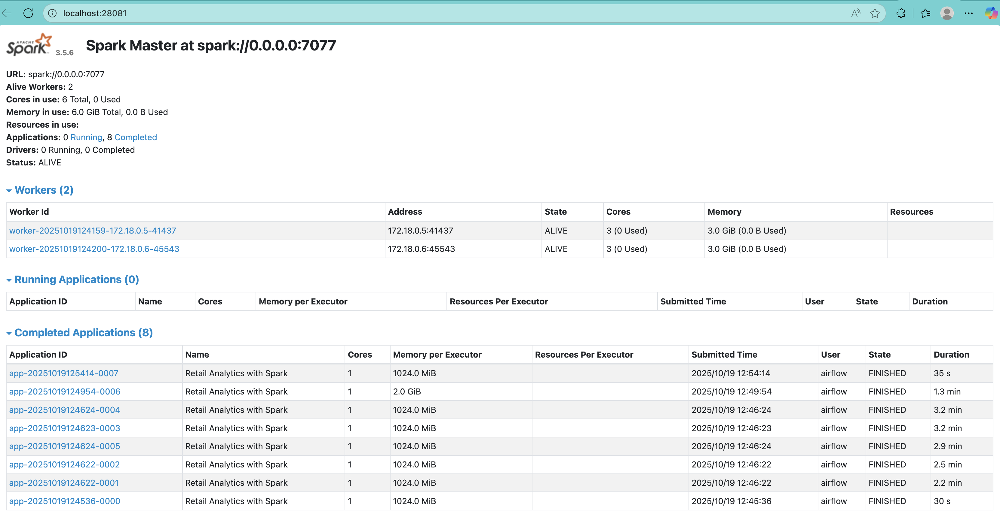
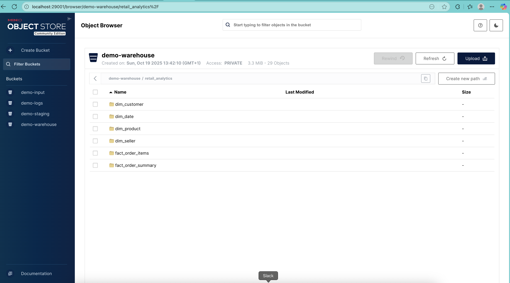
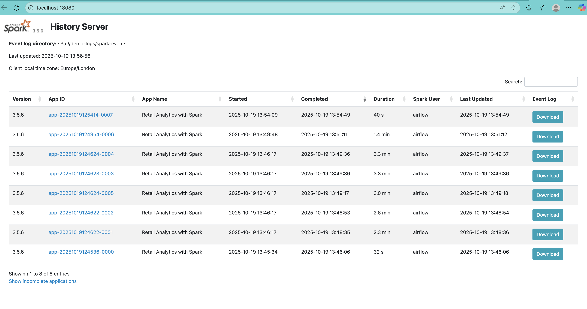

## Architecture Overview


---
## Project Setup Instructions

## **1. Environment Setup**

```bash
# 1. Clone the repository
git clone https://github.com/hardeybisey/retail-analytics-with-spark.git

# 2. Navigate into the project directory
cd retail-analytics-with-spark
```

---

## **2. Running the Project**

### **Step 1. Create a shared Docker network for minikube**

This allows Spark and Airflow containers to communicate.

```bash
docker network create minikube --subnet=172.42.0.0/16 --gateway=172.42.0.1
```


### **Step 2. Create a local kubernetes node with minikube**

> Similarly, this might take a while for the node to be setup.

```bash
  minikube start \
    --cpus=2 \
    --nodes=1 \
    --memory='no-limit' \
    --disk-size=50gb \
    --driver=docker \
    --network=minikube \
    --addons=ingress,metrics-server \
    --mount \
    --mount-string ${HOME}/Desktop/workspace/projects/retail-analytics-with-spark/airflow:/home/airflow \
```

### **Step 3. Apply the manifest to start all services**

> Similarly, this may take a while during the initial setup.

```bash
kubectl apply -k deployments/kubernetes
```


### **Step 4. Verify that all pods have the deployed**

```bash
kubectl get pods -n airflow
```

You should see entries for the Spark master, Spark worker(s), Airflow webserver, scheduler, and worker containers.

---

## **3. Accessing Pods via Ingress**

To enable access to the deployed services through their ingress URLs, add the following entry to your system’s `/etc/hosts` file:
```bash
172.42.0.2 airflow.local spark.master.local spark.history-server.local minio.local
```

### macOS Users
Unlike Linux, Docker on macOS does not provide native network connectivity between the host and container network. To enable name resolution for the above hosts, you need to install and run an additional utility.

```bash
# Install via Homebrew
$ brew install chipmk/tap/docker-mac-net-connect

# Run the service and register it to launch at boot
$ sudo brew services start chipmk/tap/docker-mac-net-connect
```

For more details, see the [docker-mac-net-connect](https://github.com/chipmk/docker-mac-net-connect) repository.

### Available Applications

| **Application**          | **URL**                                          | **Credentials**                                                 |
| ------------------------ | ------------------------------------------------ | --------------------------------------------------------------- |
| **Airflow**              | [airflow.local](airflow.local) | Use `airflow` and `airflow` for login.env`               |
| **MinIO**                | [minio.local](minio.local) | Use `minioadmin` and `minioadmin` for login. |
| **Spark Master**      | [spark.master.local](spark.master.local) | –                                                               |
| **Spark History Server** | [spark.history-server.local](spark.history-server.local) | –                                                               |


## Airflow


## Spark Master



## MinIO


## Spark History Server


---

## **4. Data Exploration Via Jupyter Notebook**

There is a Jupyter notebook server started as part of the spark serviced. You can explore the tables created and managed by icerberg through the notebook in `retail-analytics-with-spark/notebooks` folder. The jupyter server url connection is `spark.master.local`

---

## **5. Cleaning Up**

To gracefully stop and remove the running pods and kubernetes node:

```bash
# Stop and remove all pods
kubectl delete -k deployments/kubernetes

# Delete the minikube cluster
minikube delete
```
